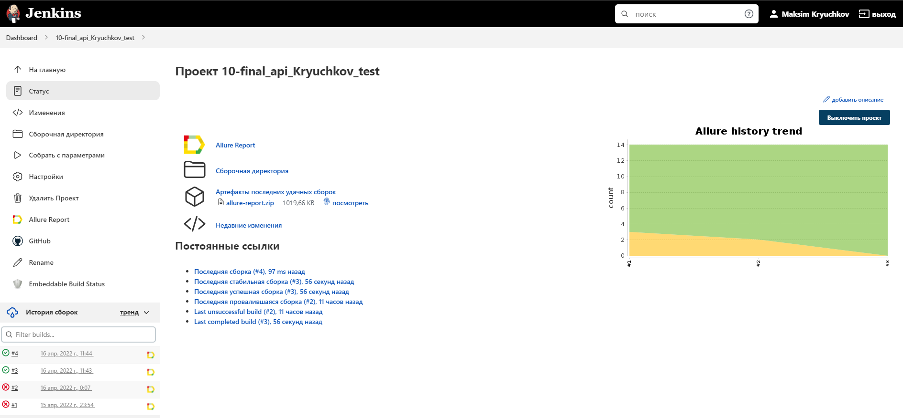

# Набор API автотестов для сайта <a target="_blank" href="https://reqres.in/">**Req | Res**</a>! 


## ✔️ Реализованы четырнадцать тестов на разные API запросы :

|| REST                 | Discription         | Status |    | REST                 | Discription          |Status |
| :--| :------------------- | :-------------------| :---:  | :--| :------------------- | :------------------- | :---:
|✓| **[GET]** user list  | Получение списка пользователей  |200|✓| **[GET]** single user | Получение одного пользователя |200|
|✓| **[GET]** single user not found   | Пользователь не найден |404|✓| **[GET]** list resource | Получение списка ресурсов |200|
|✓| **[GET]** single resource    | Получение отдельного ресурса |200|✓| **[GET]** single resource not found | Отдельный ресурс не найден |404|
|✓| **[POST]** create user   | Создание пользователя |201|✓| **[PUT]** update user | Обновление пользователя |200|
|✓ |**[PATCH]** update user   | Обновление пользователя |200|✓| **[DELETE]** user | Удаление пользователя |204|
|✓ |**[POST]** register - successful   | Успешная регистрация |200|✓ |**[POST]** register - unsuccessful  | Неудачная регистрация |400|
| ✓|**[POST]** login - successful   | Успешный логин |200|✓| **[POST]** login - unsuccessful | Неудачный логин |400|


##  ⚒️  Используемые технологии и инструменты :


## </a> Jenkins <a target="_blank" href="https://jenkins.autotests.cloud/job/10-final_api_Kryuchkov_test/"> job </a>




## Для локального запуска :
```bash
gradle clean test
```

## Для удаленного запуска с параметрами :
```bash
clean
test
```
___
## </a> Отчет в <a target="_blank" href="https://jenkins.autotests.cloud/job/10-final_api_Kryuchkov_test/4/allure/">Allure report</a>

### Overview :


### Suites : 


### Graphs :
                                                   


## </a> Отчет в телеграмм о результатах тестов :


## Остались вопросы? 
<a href="https://t.me/raboznik">
</a> 

<a href="mailto:raboznik@gmail.com">
</a>  


